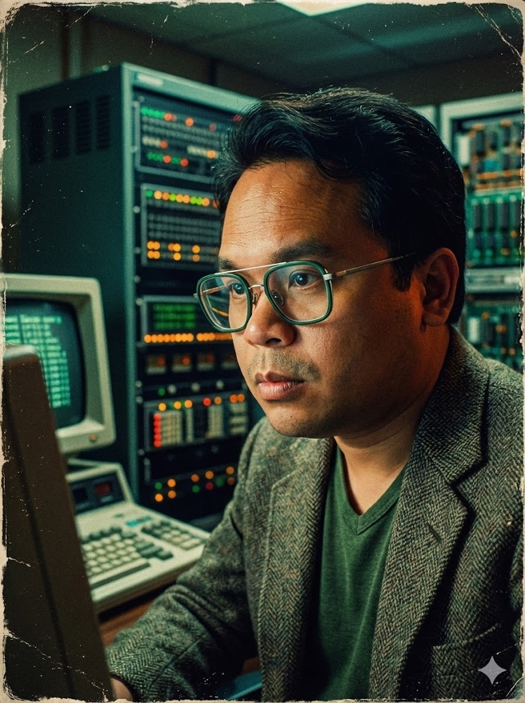

### 關於我

曾建瑋
- 誤入奇途的熱血工程師 寫 Code 練功的碩士爸🧘‍♂️ 專長是用程式與 AIGC 消滅生活中的「麻煩事」
- 白天慈濟醫院公傳，晚上為女兒努力跟上 AI 浪潮
- 致力於成為花蓮最強的數位轉型實驗家

### About me 👋
**Web Administrator** at Hualien Tzu Chi Hospital | **Master's Student** in CSIE, NDHU.
🚀 Passionate about leveraging **Python** & **GenAI (Vibe Coding)** to solve problems and drive digital transformation.

- 🏥 **Web Administrator** @ Public Communication Office, [Hualien Tzu Chi Hospital](https://hlm.tzuchi.com.tw/home/)
- 💼 **Project Manager** (2019-2021) @ [Hualien County Smart Welfare Platform](https://welfare.hl.gov.tw/people)

---

### 📫 Connect with me
Always open to connecting on AI tech and automation insights!
- [Facebook](https://www.facebook.com/petertsengtw)
- 💼 [LinkedIn](https://www.linkedin.com/in/chian-wei-tseng/)
- 🧵 [Threads](https://www.threads.net/@petertseng_tw)
- 📧 Email: [peter.qfx@gmail.com](mailto:peter.qfx@gmail.com)
